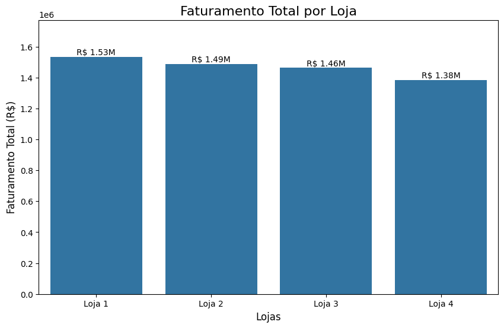
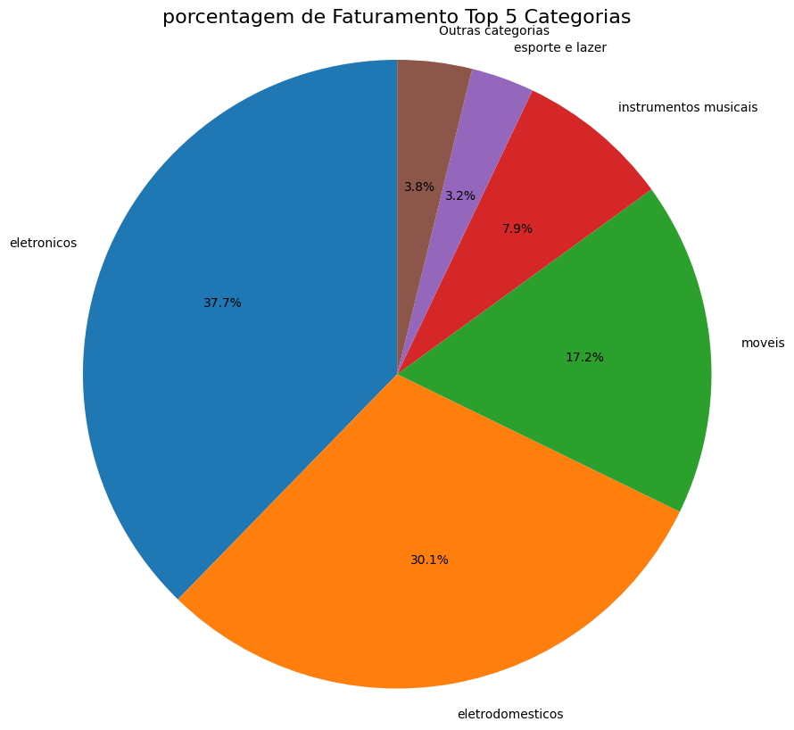
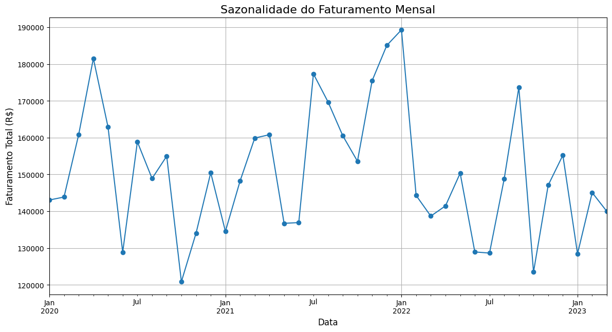

<h1 align="center" style="color:#004aad;">📊 Análise de Vendas e Desempenho das Loja</h1>

  <em>Projeto desenvolvido para explorar padrões de vendas, categorias mais populares e desempenho das lojas utilizando Python e DuckDB.</em>

---

## 🚀  Etapas do Projeto

###   1. Processamento e Transformação dos Dados
- Os dados foram coletados a partir de arquivos CSV locais.
- O carregamento foi feito utilizando **Pandas** para processar e transformar os CSVs em Dataframes
---
###   Transformação dos Dados

Durante a análise do projeto, percebi que os dados já estavam bem <strong>“redondinhos”</strong> — sem valores nulos, duplicatas ou grandes inconsistências.  
Ainda assim, há alguns ajustes e boas práticas que ajudam a <strong>organizar</strong> e <strong>agilizar</strong> a análise.  

---

#### Unir DataFrames com <code>concat</code> e criar um ID para as lojas

Quando trabalhamos com dados de múltiplas fontes, mas com a <strong>mesma estrutura</strong> (por exemplo: Loja 1, Loja 2, Loja 3...),  
o método <code>concat</code> é perfeito para juntar tudo em um único DataFrame.

<em>O pulo do gato:</em> antes de concatenar, adicione uma coluna identificando a origem dos dados.  
Por exemplo:

####  Arredondar valores com <code>round</code>

 Parece simples, mas dados financeiros — como <strong>Preço</strong> e <strong>Frete</strong> — ficam muito mais limpos e padronizados quando utilizamos o arredondamento para duas casas decimais. 

 Isso ajuda a manter o formato monetário consistente e melhora a legibilidade dos relatórios e dashboards. 

#### Converter datas com <code>datetime</code>

 Colunas de data em formato de string não são muito úteis para análises temporais. Ao usar <code>pd.to_datetime</code>, abrimos caminho para explorar tendências e sazonalidades. 

 Assim, é possível agrupar por <strong>ano</strong> e <strong>mês</strong> para identificar padrões de comportamento ao longo do tempo. 

## 2. Etapas da Análise

A seguir estão descritas as principais análises conduzidas no notebook, com suporte visual dos gráficos gerados.

---

### Faturamento Total por Loja

O faturamento é a principal métrica de desempenho das lojas.  
A análise consolidada mostrou uma clara diferença no desempenho financeiro das quatro unidades da <strong>AluraStore</strong>:

<table style="width:60%; border-collapse: collapse; margin-top:10px;">
  <tr style="background-color:#f0f6ff;">
    <th>Loja</th><th>Faturamento Total (R$)</th><th>Posição</th>
  </tr>
  <tr><td>Loja 1</td><td style="color:#004aad; font-weight:bold;">R$ 1.534.509,12</td><td>1º</td></tr>
  <tr><td>Loja 2</td><td style="color:#0077b6;">R$ 1.488.459,06</td><td>2º</td></tr>
  <tr><td>Loja 3</td><td style="color:#0077b6;">R$ 1.464.025,03</td><td>3º</td></tr>
  <tr><td>Loja 4</td><td style="color:#c1121f;">R$ 1.384.497,58</td><td>4º</td></tr>
</table>

 O gráfico abaixo ilustra o desempenho financeiro total de cada loja:

Conclusão: A Loja 4 apresenta o desempenho financeiro mais baixo, com cerca de R$ 150 mil a menos que a Loja 1.

---

###  Faturamento por Categoria

A análise por categoria revela que a receita é fortemente concentrada em produtos de maior valor agregado:

<ul>
  <li><strong style="color:#004aad;">Eletrônicos</strong> — 37,7%</li>
  <li><strong style="color:#2e8b57;">Eletrodomésticos</strong> — 30,1%</li>
  <li><strong style="color:#2e8b57;">Móveis</strong> — 17,2%</li>
</ul>

Essas três categorias representam <strong style="color:#004aad;">85% do faturamento total</strong> da rede AluraStore.

Observação: Categorias de menor volume, como “Instrumentos Musicais” e “Esporte e Lazer”, têm participação marginal no total de vendas.

---

###  Sazonalidade de Vendas

A avaliação temporal do faturamento demonstra um comportamento <strong>cíclico</strong> ao longo dos meses.  
É possível observar picos de vendas em alguns períodos específicos, indicando sazonalidade — possivelmente associada a datas promocionais ou épocas festivas.

Essa análise é crucial para definir estratégias de estoque, marketing e logística em períodos de maior demanda.

---
<h1 align="center" style="color:#2F5496;">📊 Relatório de Desempenho da Rede <strong>AluraStore</strong></h1>

  <em>Fonte de dados:</em> <code>Arquivos CSV das lojas</code> consolidando <strong>9.435 vendas</strong> das quatro lojas da rede. 
  <em>Objetivo:</em> Avaliar o desempenho financeiro e operacional para subsidiar a decisão estratégica de venda de uma loja.

---

## 🏪 1. Faturamento Total por Loja

O <strong>faturamento</strong> é a principal métrica de desempenho financeiro. A tabela abaixo resume os resultados:

<table>
  <thead>
    <tr>
      <th>Loja</th>
      <th>Faturamento Total</th>
      <th>Posição</th>
    </tr>
  </thead>
  <tbody align="center">
    <tr>
      <td><strong>Loja 1</strong></td>
      <td style="color:#2F5496; font-weight:bold;">R$ 1.534.509,12</td>
      <td>1º 🥇</td>
    </tr>
    <tr>
      <td><strong>Loja 2</strong></td>
      <td style="color:#4472C4; font-weight:bold;">R$ 1.488.459,06</td>
      <td>2º</td>
    </tr>
    <tr>
      <td><strong>Loja 3</strong></td>
      <td style="color:#70AD47; font-weight:bold;">R$ 1.464.025,03</td>
      <td>3º</td>
    </tr>
    <tr>
      <td><strong>Loja 4</strong></td>
      <td style="color:#C00000; font-weight:bold;">R$ 1.384.497,58</td>
      <td>4º</td>
    </tr>
  </tbody>
</table>

<strong>Conclusão:</strong> A Loja 4 apresenta o pior desempenho financeiro, faturando cerca de <strong>R$ 150.000 a menos</strong> que a Loja 1.

<!-- Inserir gráfico de barras comparando o faturamento das lojas -->

---

## ⭐ 2. Média de Avaliação dos Clientes

A satisfação do cliente foi analisada a partir da média das avaliações:

<ul>
  <li><strong style="color:#70AD47;">Melhor Avaliação:</strong> Loja 3 (4.05)</li>
  <li><strong style="color:#C00000;">Pior Avaliação:</strong> Loja 1 (3.98)</li>
  <li><strong>Loja 4:</strong> Avaliação intermediária (4.00)</li>
</ul>

<strong>Análise:</strong> A Loja 1, apesar do maior faturamento, apresenta a pior avaliação. Já a Loja 4 mantém uma boa percepção dos clientes.

<!-- Inserir gráfico de colunas ou radar de média de avaliações por loja -->

---

## 🚚 3. Custo Médio do Frete por Loja

O custo logístico é um fator determinante para a margem de lucro. A seguir, a média de frete por loja:

<table>
  <thead>
    <tr>
      <th>Loja</th>
      <th>Custo Médio do Frete</th>
    </tr>
  </thead>
  <tbody align="center">
    <tr>
      <td><strong>Loja 1</strong></td>
      <td style="color:#C00000; font-weight:bold;">R$ 34,69</td>
    </tr>
    <tr>
      <td><strong>Loja 2</strong></td>
      <td>R$ 33,17</td>
    </tr>
    <tr>
      <td><strong>Loja 3</strong></td>
      <td>R$ 32,58</td>
    </tr>
    <tr>
      <td><strong>Loja 4</strong></td>
      <td style="color:#70AD47; font-weight:bold;">R$ 31,28</td>
    </tr>
  </tbody>
</table>

<strong>Análise:</strong> A Loja 4 apresenta o <strong>frete mais barato</strong> da rede, enquanto a Loja 1 tem o custo mais alto, afetando sua lucratividade.

<!-- Inserir gráfico de barras horizontais para custo médio de frete -->

---

## 🛒 4. Análise de Categorias e Produtos (Nível Rede)

O desempenho das categorias mostra os principais motores de receita.

### 📈 Faturamento por Categoria
<table>
  <thead>
    <tr>
      <th>Categoria</th>
      <th>Participação no Faturamento</th>
    </tr>
  </thead>
  <tbody align="center">
    <tr>
      <td><strong>Eletrônicos</strong></td>
      <td style="color:#2F5496; font-weight:bold;">37,7%</td>
    </tr>
    <tr>
      <td><strong>Eletrodomésticos</strong></td>
      <td style="color:#70AD47; font-weight:bold;">30,1%</td>
    </tr>
    <tr>
      <td><strong>Móveis</strong></td>
      <td style="color:#ED7D31; font-weight:bold;">17,2%</td>
    </tr>
  </tbody>
</table>

<em>Observação:</em> Essas três categorias somam <strong>85% da receita total</strong>.

<!-- Inserir gráfico de pizza ou colunas de faturamento por categoria -->

### 📦 Volume de Unidades Vendidas
<table>
  <thead>
    <tr>
      <th>Categoria</th>
      <th>Unidades Vendidas</th>
    </tr>
  </thead>
  <tbody align="center">
    <tr>
      <td><strong>Móveis</strong></td>
      <td style="color:#2F5496; font-weight:bold;">1.886</td>
    </tr>
    <tr>
      <td><strong>Eletrônicos</strong></td>
      <td>1.772</td>
    </tr>
    <tr>
      <td><strong>Brinquedos</strong></td>
      <td>1.290</td>
    </tr>
  </tbody>
</table>

<!-- Inserir gráfico de colunas do volume de vendas por categoria -->

---

## 💡 5. Cenários Estratégicos

Com base nas métricas, foram definidos dois cenários para a decisão de venda:

### 🔹 Cenário 1 – Vender a Loja de Pior Desempenho (Recomendado)

- **Recomendação:** Vender a <strong>Loja 4</strong>  
- **Justificativa:** É o ativo de <strong>menor receita</strong> da rede.  
  A venda reduzirá o impacto financeiro global e liberará capital.  
- **Ponto de Atenção:** Possui <strong>frete mais barato</strong> e <strong>boa avaliação</strong>.

---

### 🔸 Cenário 2 – Vender a Loja de Maior Valor (Alternativa)

- **Alternativa:** Vender a <strong>Loja 1</strong>  
- **Justificativa:** Se o objetivo for <strong>maximizar o retorno imediato</strong>,  
  a Loja 1 tem o <strong>maior faturamento (R$ 1,53M)</strong> e, portanto, maior valor de venda.  
- **Ponto de Atenção:** Tem o <strong>maior custo de frete</strong> e a <strong>pior avaliação</strong> da rede.

---

## ✅ Recomendação Final

> A decisão mais segura e racional é **vender a Loja 4**.

- Menor faturamento (**R$ 1,38M**)  
- Menor impacto na receita global  
- Mantém lojas mais rentáveis e consistentes  
- Otimiza o portfólio e reduz custos de operação  

---

## 📘 Resumo Executivo

<table>
  <thead>
    <tr>
      <th>Indicador</th>
      <th>Melhor Loja</th>
      <th>Pior Loja</th>
    </tr>
  </thead>
  <tbody align="center">
    <tr>
      <td><strong>Faturamento Total</strong></td>
      <td style="color:#2F5496;">Loja 1 (R$ 1,53M)</td>
      <td style="color:#C00000;">Loja 4 (R$ 1,38M)</td>
    </tr>
    <tr>
      <td><strong>Avaliação de Clientes</strong></td>
      <td style="color:#70AD47;">Loja 3 (4.05)</td>
      <td style="color:#C00000;">Loja 1 (3.98)</td>
    </tr>
    <tr>
      <td><strong>Custo Médio do Frete</strong></td>
      <td style="color:#70AD47;">Loja 4 (R$ 31,28)</td>
      <td style="color:#C00000;">Loja 1 (R$ 34,69)</td>
    </tr>
  </tbody>
</table>

<!-- Inserir gráfico final de resumo visual ou dashboard -->
